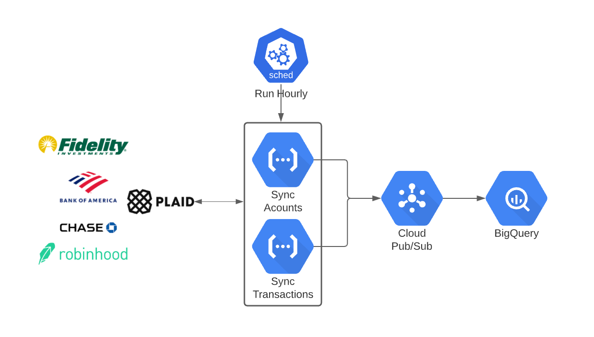

# abstract-capital :money_with_wings:

Abstract Capital is a privacy-preserving personal finance data platform. This repo is the basis for the prototype described [here](https://n2parko.com/blog/select-robinhood-stocks)

## Requirements

1. A [Plaid](https://plaid.com/) account (linked to your Accounts)
2. A [Google Cloud](cloud.google.com) account with PubSub, Google Cloud Functions, Cloud Scheduler & BigQuery enabled

## How It Works

Here's how Abstract Capital works...

- **Auth with Plaid**: Run a Plaid app to authenticate into your accounts
- **Sync:** A scheduled sync periodically pulls data from accounts (via Plaid) and write to topics in pubsub. I set the scheduler to run hourly to start.
- **Consumers:** Consumers will subscribe to pubsub and write to destinations (e.g. BigQuery, Airtable)

